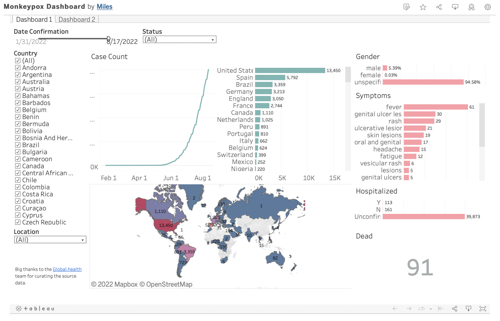
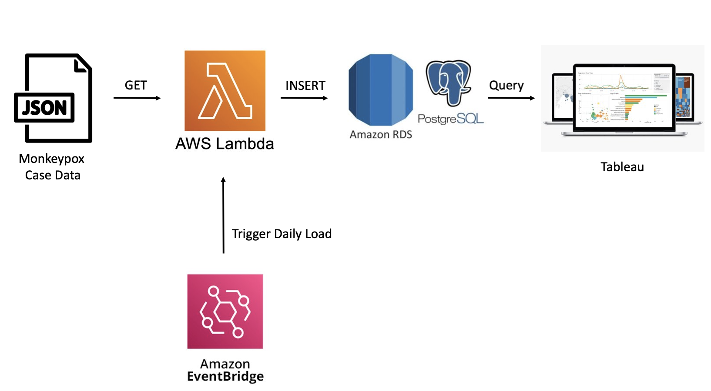

# Monkeypox Dashboard

Dashboard for tracking the spread of Monkeypox. Check it out [here](https://public.tableau.com/app/profile/miles6013/viz/MonkeypoxDashboard_16592277053130/Dashboard1).

Note: Daily batch load is currently suspended. Dashboard was last updated September 9, 2022.

## Methodology

The dashboard is desighed to update daily with the latest reported monkeypox cases. The ETL is as follows.

The Lambda function executes a Python script containing all business logic. Amazon EventBridge provides a scheduled time as the trigger. This is effectively a serverless cron job.

The Python script executed by AWS Lambda does the following:

1. Submits a GET request to a URL on this [GitHub repo](https://github.com/globaldothealth/monkeypox) containing a JSON file (which is no longer being uploaded)
2. Converts it into a Pandas dataframe and prepares it for loading
3. Loads it into a PostgreSQL database hosted on Amazon RDS

Credits to [Global.health](https://github.com/globaldothealth/monkeypox) for maintaining the source data.
